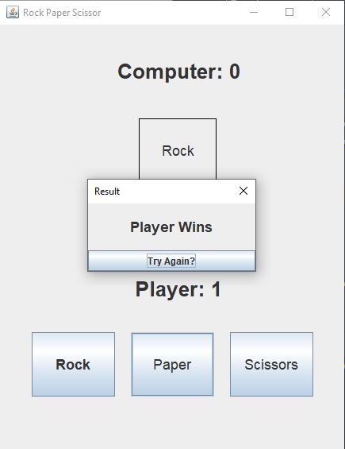
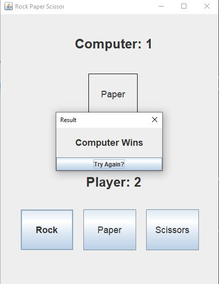
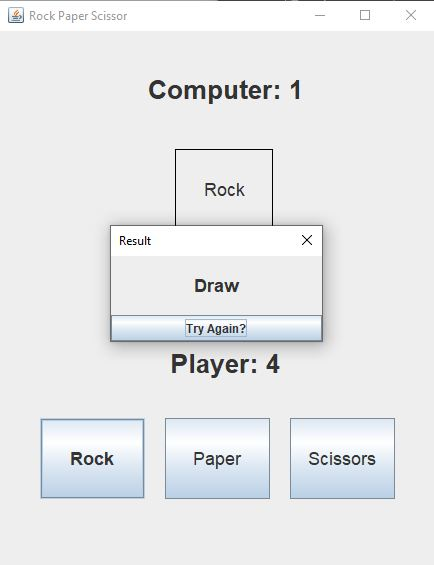

# Rock Paper Scissors Game (Java Swing)

A simple Rock Paper Scissors game implemented in Java using Swing for the GUI.  
Players can choose Rock, Paper, or Scissors and play against the computer, with scores updated in real-time.

---

## Features

- Interactive GUI built with Java Swing
- Play against a computer with random choices
- Displays the computer's choice after each round
- Keeps track of scores for both player and computer
- Result dialog showing the outcome of each round
- "Try Again?" option to continue playing

---

## How It Works

1. **Backend Logic**  
   The `RockPaperScissor` class handles:
   - Computer random choice generation
   - Game outcome calculation (Player Wins, Computer Wins, Draw)
   - Score keeping for both player and computer

2. **Frontend GUI**  
   The `RockPaperScissorGUI` class provides:
   - Buttons for player choices (Rock, Paper, Scissors)
   - Labels to display scores and computer's choice
   - Dialog pop-ups showing the result of each round
   - Absolute positioning for easy layout

---

## How to Run

1. Clone the repository or download the source code.
2. Compile the backend and GUI classes:
   ```bash
   javac RockPaperScissor.java RockPaperScissorGUI.java
    ```

3. Run the GUI:

   ```bash
   java RockPaperScissorGUI
   ```

---

## Screenshots

Here are examples of different game outcomes:

### 1. Player Wins



### 2. Computer Wins



### 3. Draw



---

## Controls

* Click the **Rock**, **Paper**, or **Scissors** button to make your move.
* The computer's choice is displayed in the box above the buttons.
* A dialog appears showing the result (Player Wins / Computer Wins / Draw).
* Click **Try Again?** to continue playing.

---

## Author

Developed by **Mouad OUMOUS**.

---

## License

This project is licensed under the Apache 2 License. See the [LICENSE](LICENSE) file for details.

